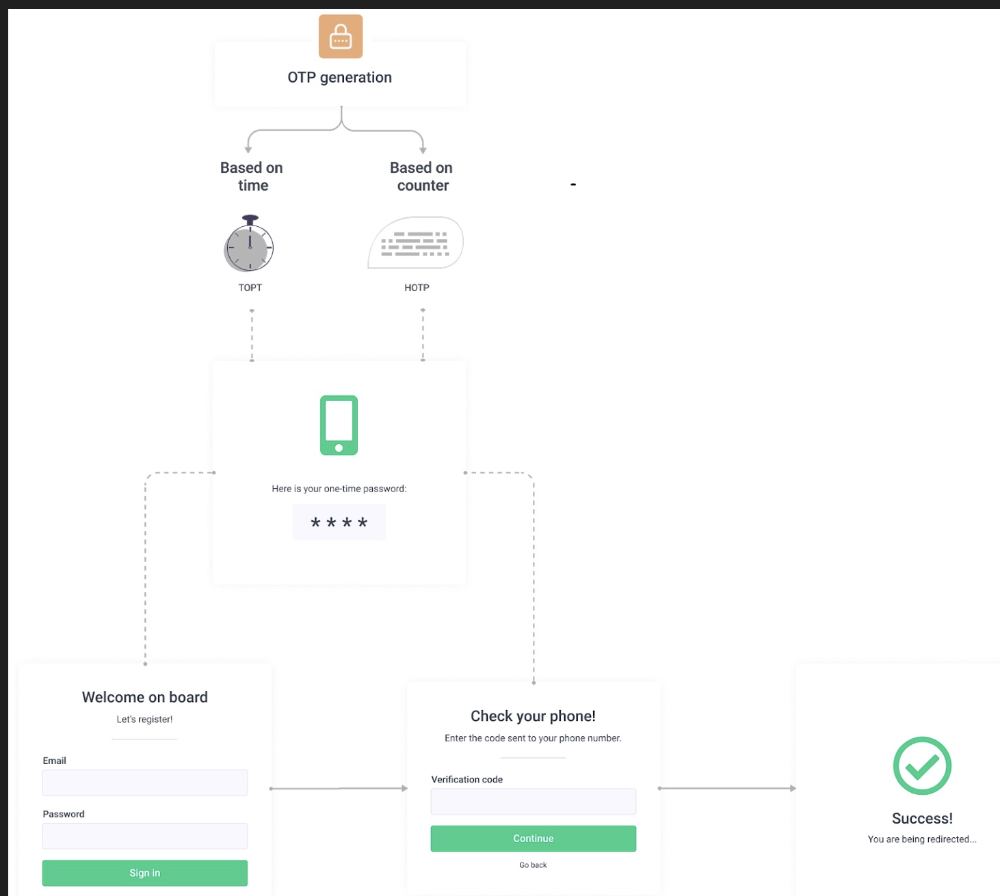
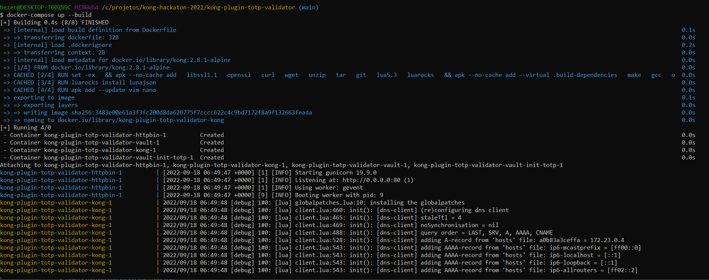
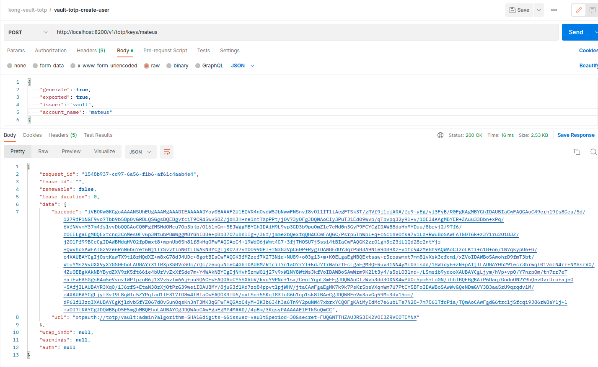
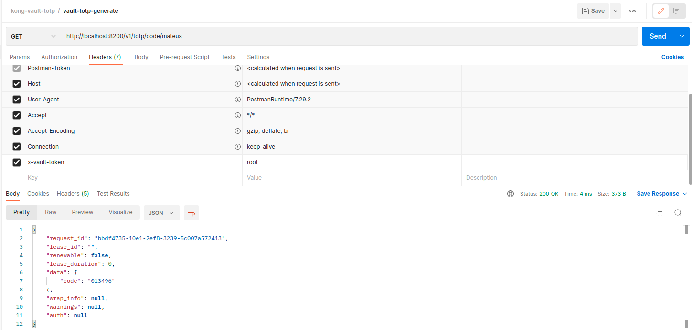
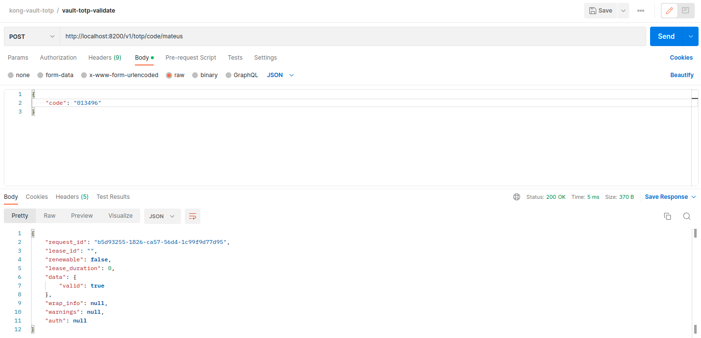
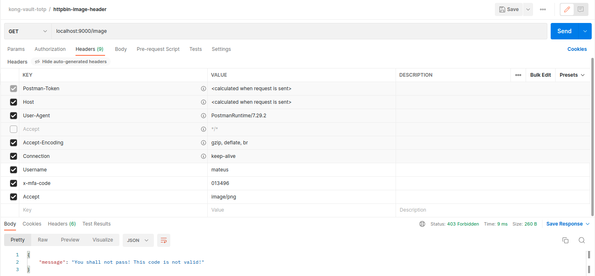
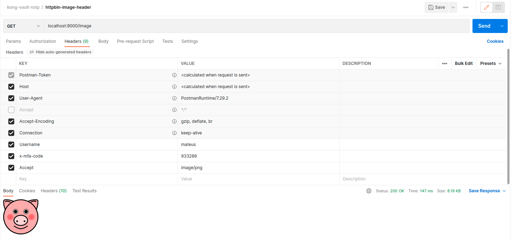
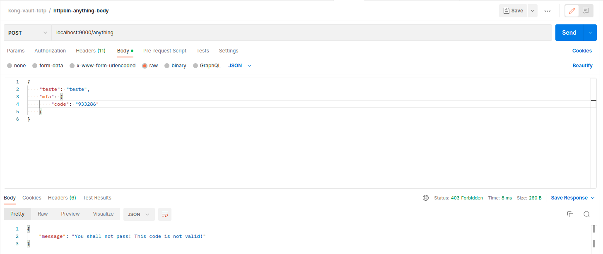
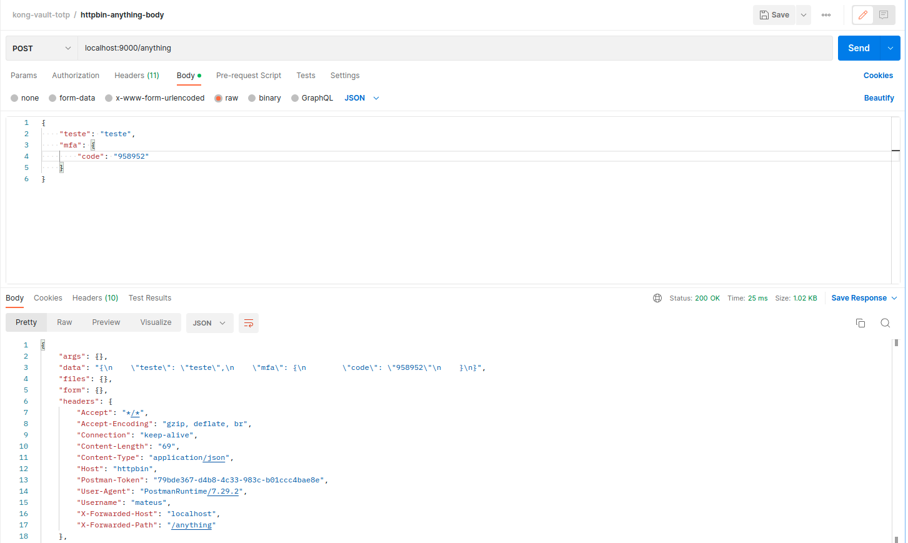

<!---  [![Build Status][badge-travis-image]][badge-travis-url] --->

# Kong-plugin-totp-validator

## Presentation

Slide presentation about this opensource plugin: https://docs.google.com/presentation/d/14WFGPD53HxOksOrHuONl8-0Xh-XWyW83TkNWGYdrBQY/edit?usp=sharing

## About this project

This project is a Lua-based plugin for Kong API Gateway that allows you to define routes and services that requires a valid TOTP code.

The plugins works by intercepting the requests being made and confirmating (with HTTP requests to a TOTP provider like Hashicorp Vault)
if the code was provided in the defined location (body or header) and if the code provided was already validated by the user.

This plugin was developed and tested under Kong 2.8.1, but it should work on newer releases incluing the new 3.0.0 release.

<b>We are testing this plugin yet, so It is possible to find some bugs. Please report bugs!</b>

## The Problem

Username and password arent enough to guarantee security, so it is common to add a second factor authentication (2FA) or multiple factor authentication (MFA).

TOTP means time based one-time password, and is a common form of two-factor authentication. Unique numeric passwords are generated with an
algorithm that uses the current time as the input. Time-based passwords expire, and therefore offer greater security for 2FA or MFA.



Image Source: https://www.arengu.com/blog/hotp-vs-otp-vs-totp-differences

There are also some people that like the idea of using TOTP as an alternative to oauth2 refresh tokens
(https://blog.devgenius.io/can-totp-be-used-as-an-alternative-to-refresh-tokens-5b992b28e45e).

## Project Structure

This project folder structure:

- `.pongo`: contais base scripts and configuration for Pongo-based integration tests
- `k6`: a sample load testing script
- `kong`: the plugin code itself containing a `schema.lua` (the definition of the schema for the expected plugin configuration) and a `handler.lua` (where the plugin logic is implemented)
- `postman`: Contains a json file with a collection that you can import in Postman with requests pre-configured to perform the basic demonstrations of this plugin funcionallity.
- `spec`: Contains some unit tests for the plugin.

At the root folder there also a few important files:

- a `.rockspec` file specifying the current version of the package and its dependencies
- a `kong.yml` with the Kong Declarative Configuration with some services and routes
- `Dockerfile` and `docker-compose.yml`: scripts to run a demonstration environment using Kong in DB LESS mode, a local HTTPBIN server and a Hashicorp Vault instance with TOTP enabled

## Rockspec Format

The `.rockspec` file should follow [LuaRocks' conventions](https://github.com/luarocks/luarocks/wiki/Rockspec-format)

## Configuration

### Enabling the plugin on a Service

Configure this plugin on a Service with the declarative configuration:

Receiving otp code in the body
```bash
_format_version: "2.1"
_transform: true
services:
- name: httpbin-service
  url: http://httpbin:80
  retries: 0
  connect_timeout: 5000
  write_timeout: 5000
  read_timeout: 5000
  plugins:
  - name: kong-plugin-totp-validator
    config:
      backend_url: http://vault:8200
      backend_path: /v1/totp/code
      vault_token: root
      body_code_location: mfa.code
```

Receiving otp code in the header
```bash
_format_version: "2.1"
_transform: true
services:
- name: httpbin-service
  url: http://httpbin:80
  retries: 0
  connect_timeout: 5000
  write_timeout: 5000
  read_timeout: 5000
  plugins:
  - name: kong-plugin-totp-validator
    config:
      backend_url: http://vault:8200
      backend_path: /v1/totp/code
      vault_token: root
      header_code_location: x-mfa-code
```

You can also configure the plugin directly in a route or using the Kong Admin API when not running Kong in DBLESS mode.

### Plugin configuration parameters

| Parameter name       | Required | Description | Default value | Type   |
|----------------------|----------|-------------|---------------|--------|
| backend_url          | true         | Base Url for the TOTP backend (the vault)           |               | String |
| backend_path         | true         | Base Path for the TOTP backend (the vault)          |               | String |
| vault_token          | true         | A token for the communication with the TOTP / vault.                |               | String |
| body_code_location   | false        | If defined , the plugin code will get otp from request.body.<configuration>            |               | String |
| header_code_location | false        | If defined , the plugin code will get otp from request.headers.<configuration>            |               | String |

IMPORTANT: it is required to configure body_code_location OR header_code_location

## Developing and testing the plugin

### Executing the development environment with docker

```bash
docker-compose up --build
```



### Importing the POSTMAN collection and test the plugin

Import the collection (json file located in the postman folder) in Postman, and follow the steps below to execute some real requests and check the plugin behavior:

- start the demo environment using the docker compose command ` docker-compose up --build `
- open Postman and import the collection
- make a request to create a user
- make a login request
- generate and obtain an otp code
- validate the otp code
- make a request to a route, passing a validated OTP code that will be accepted by tha vault and will result in a 200 HTTP status code
- make a request to a route, passing a non-validated OTP code that will be rejected by tha vault and notice that the request will fail and return 403 status code















## TODO List

This plugin is still evolving, and the next features planned are:

- there is a limitation to combining body_code_location and header_code_location with HTTP methods
- a configuration to allows the definition of the HTTP status code to be returned in case the user does not send an OTP code
- a configuration to allows the definition of the HTTP status code to be returned in case the user does not send a VALID OTP code
- configurations to allows customizations of the error messages and body formats returns by the plugin in the fail scenarios
- improve the Docker script, to test this plugin with others TOTPs providers
- add more test cases
- add resiliency in the communication between the kong plugin and the OTP provider (better error handling and some retry logic inspired by Iguana Tools: https://help.interfaceware.com/v6/retry-example)
- accepted GRPC protocol

## Credits

made with :heart: by Marcelo Bezerra (https://www.linkedin.com/in/bovino/) and Mateus Fonseca (https://www.linkedin.com/in/mateus-lima-fonseca/)
