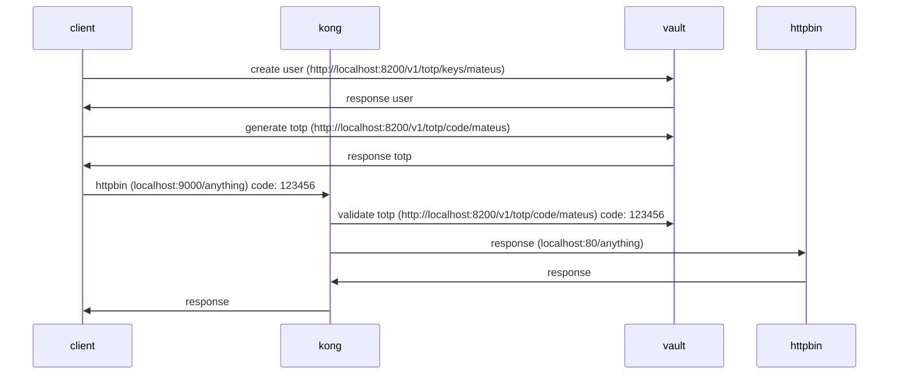

```mermaid
sequenceDiagram
    participant client
    participant kong
    participant vault
    participant httpbin

    client ->> vault: create user (http://localhost:8200/v1/totp/keys/mateus)
    vault ->> client: response user

    client ->> vault: generate totp (http://localhost:8200/v1/totp/code/mateus)
    vault ->> client: response totp

    client ->> kong: httpbin (localhost:9000/anything) code: 123456
    kong ->> vault: validate totp (http://localhost:8200/v1/totp/code/mateus) code: 123456
    kong ->> httpbin: response (localhost:80/anything)
    httpbin ->> kong: response
    kong ->> client: response
```
